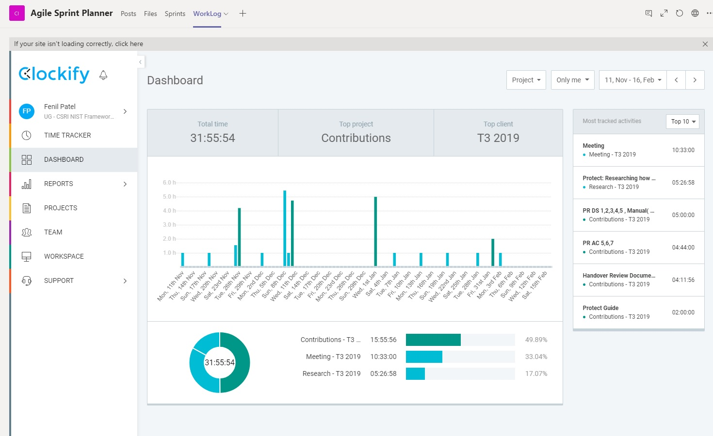
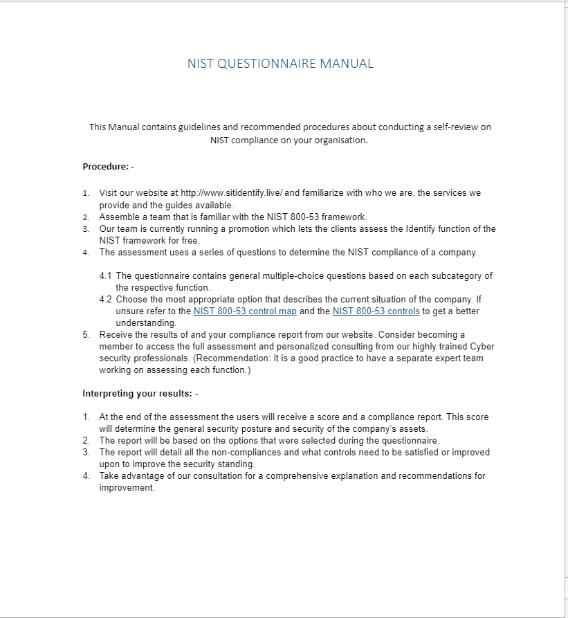

<html>
    <head>
    </head>
    <body>
        <h1>Portfolio</h1>
        <h2>Personal Profile</h2>
        
Final Year Bachelor of Cyber Security student with an extensive record of good academic performance and proven work ethic. Academic experience in developing basic-intermediate IT solutions. Demonstrated ability to work with team members and customers alike in a fast-paced retail environment. I have cultivated top notch technical as well as soft skills through my experience as a Retail worker and a Cyber security undergraduate student. My retail experience has also taught me to deal with client enquiries, grievances and provide effective advice patiently and efficiently

        <ul>
            <li>I have a good academic record of working with a group and individually to complete various projects across different subjects.</li>
            <li>Strong computer skills with intermediate expertise over various IT systems, Cyber Security Practices, MS office, Networking, programming and report writing.</li>            
        </ul>
        <h2>Assertion</h2>
        
My contribuiton to the project were mainly in documentation, planning, scripting and recording meeting minutes. Through my contribution directly towards the NIST questionnaire which is the analytical backbone of the whole project. This Questionnaire would form the content that is entered into the proposed web application. I have also recorded Meeting Minutes and contributing towards writing the script for the  showcase. The meeting minutes kept a record of all the discussion during the weekly meeting while keeping notes of the immediate sprint goals.
        

        <h2>Introduction</h2>
        
The core of this project is the NIST questionnaire that will be delivering a maturity-based assessment model. The questionnaire will be validated though many tests on Deakin departments and a select few businesses.This takes the NIST cyber security framework and creates a question set for each function; Identify, Protect, Detect, Respond, Recover. Based on the scoring we decide we can give the customer a report to baseline their current Cyber Security posture. This can be used by the consultant to help guide the customer regarding where to spend their time and finances to best improve their security. There will be supplementary guides to enable business to access generic information on the controls required to uplift in certain NIST categories. The Questionnaire and guides are made in a way that it can be easily transformed to work with existing infrastructure and systems.
        

        

        The aim of the project is to deliver a self-assessment of the NIST framework that will be used by an Australian business. The NIST framework will have a heavy consulting aspect once an assessment is completed, this will be completed by Deakin students in the cybersecurity degree with the help of an industry professional. 
        

        <h2>Personal Contributions</h2>
        <h3>Meeting Minutes</h3>
        
I have punctually attended all the meetings and recorded important details being discussed. The recorded meeting minutes provided a rundown of the overall progress of the project, the doubts that need to be cleared, overall project direction, updates as well as feedback. The meeting minutes have played an important role in planning weekly activities, setting out immediate targets as well as removing blockers in the project development.

        <ul>
            <li><a href = "https://teams.microsoft.com/l/channel/19%3A083bb410c7b54405aa510e355204da69%40thread.skype/tab%3A%3Ad7d9fcb8-0eab-43e6-b45c-113431e5c4e3?groupId=9b3f6292-dea5-4167-9bdb-56c751f5b0a3&tenantId=d02378ec-1688-46d5-8540-1c28b5f470f6">Meeting Minutes</a></li>
        </ul>
        <h3>NIST Questionnaire Document</h3>
        
I wrote and reviewed several sections of the questionnaire document particularly in the project category. The questionnaire is the analytical backbone of the project. The questions were formulated to be a high level overview of different requirements that need to be fulfilled to satisfy a particular sub-category at different levels of efficiency. This is the client facing side of the application and the client responses will be essential to understaning their security posture. I and the rest of our team tried to formulate it in a way that its a high level overview while not compromising on important details on how to satisfy a sub-category requirements. It was important to keep the document clear, concise and to the point in order to correctly and efficiently capture the clients' cyber-security profile.The Questionnaire is not final and after the last review improvements were suggested to make it more accesible and implement some corrections.

        <ul>
            <li><a href="https://teams.microsoft.com/l/channel/19%3A083bb410c7b54405aa510e355204da69%40thread.skype/tab%3A%3A5167caff-eab2-4e86-bc50-2c21f060dfcd?groupId=9b3f6292-dea5-4167-9bdb-56c751f5b0a3&tenantId=d02378ec-1688-46d5-8540-1c28b5f470f6">NIST Question Set.Sections PR.AC 4,5,6,7,PR.DS</a></li>
        </ul>
        <h3>Showcase Contributions and Guide Template</h3>
        
Contributed towards writing a script for the showcase as well as other details such as orders and artefacts to be presented in the showcase. I also prepared a guide template for the different questionnaire sections. These guides contain additional information about the controls and subcategories being assessed in the questionnaire document that clients can refer to for free.

        <ul><li><a href = "https://teams.microsoft.com/l/file/5CD51658-3B9B-4D00-A10B-A7D2C7B92563?tenantId=d02378ec-1688-46d5-8540-1c28b5f470f6&fileType=docx&objectUrl=https%3A%2F%2Fdeakin365.sharepoint.com%2Fsites%2FCSRI-IDENTIFY-Group2%2FShared%20Documents%2FGeneral%2FGuides%2FGuide_PR.AC_FenilPatel.docx&baseUrl=https%3A%2F%2Fdeakin365.sharepoint.com%2Fsites%2FCSRI-IDENTIFY-Group2&serviceName=teams&threadId=19:083bb410c7b54405aa510e355204da69@thread.skype&groupId=9b3f6292-dea5-4167-9bdb-56c751f5b0a3">Guide Template PR.AC</a></li></ul>
        <h3>Miscellenous Contributions, Worklog and Evidence</h3>
        
I have also made various contributions towards the project by guiding the junior team members to best achieve their goals. I have also created a manual for the web application but there was a conscious decision from the team to exclude it from the final project showcase and submission at this stage. I also helped to create the handover review document which reiterated the goals of our project and any quality of life changes to the project in the coming sprints.This section also contains various pieces of evidences and artefacts produced throughout the sprints.

        <figure><figcaption><b>Clockify Summary Report</b></figcaption></figure>
        <figure><figcaption><b>Draft Manual</b></figcaption></figure>
        <dl>
            <dt>Important Links</dt>
            <dd>
                <a href ="https://teams.microsoft.com/l/file/36391271-86f6-419d-b7e5-712daccc84fd?tenantId=d02378ec-1688-46d5-8540-1c28b5f470f6&fileType=docx&objectUrl=https%3A%2F%2Fdeakin365-my.sharepoint.com%2Fpersonal%2Fzhangrongb_deakin_edu_au%2FDocuments%2FMicrosoft%20Teams%20Chat%20Files%2FSIT302%20Review%20-%20CSRI%20NIST.docx&baseUrl=https%3A%2F%2Fdeakin365-my.sharepoint.com%2Fpersonal%2Fzhangrongb_deakin_edu_au%2F&serviceName=p2p&threadId=19:79bea22897d14511a6bf1159e52afdde@thread.v2"><b>Sprint Review Document</b></a>
            </dd>
            <dd>
                <a href = "http://www.sitidentify.live"><b>Deakin Cyber security Consultancy Website</b></a>
Disclaimer: I personally was not involved in programming the website. My interactions with the website were limited to crafting a manual and developing understanding of how the web application would work.

            </dd>
        </dl>
    </body>
</html>
